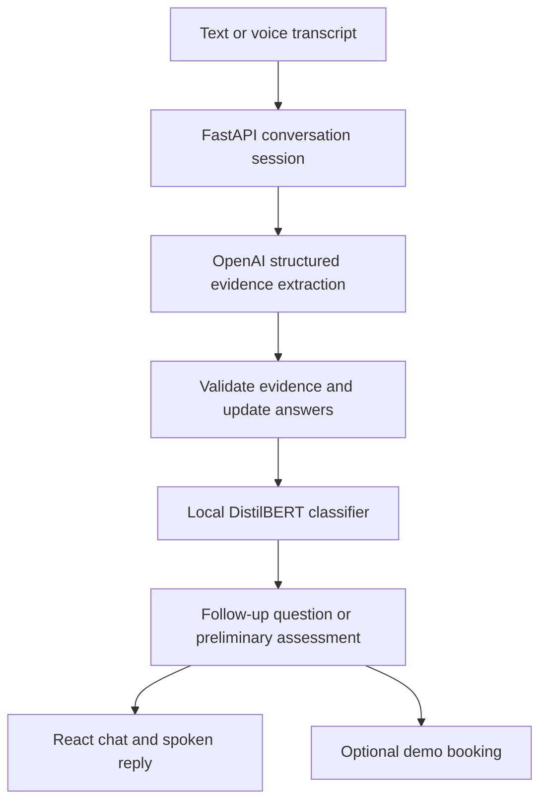

# DDx Engine

A symptom-assessment app that combines a locally fine-tuned classifier with a conversational interface. Describe symptoms through text or voice, answer follow-up questions, and receive a preliminary assessment. A separate demo booking flow lets you select a fictional practitioner and appointment time.

This is an educational project, not a clinical service. It cannot confirm a diagnosis or arrange real medical care.

## Why separate the model from the conversation?

The first version accepted symptoms and returned three ranked conditions. It could classify an input, but it could not conduct a useful conversation. Repeated questions and predictions from incomplete histories made that distinction clear.

The current design keeps two responsibilities separate. A local transformer predicts condition labels from collected evidence. OpenAI extracts symptoms from everyday language and helps phrase the conversation. FastAPI maintains the session, applies corrections, and decides whether to ask another question or return an assessment.



## Model comparison

Both classifiers were fine-tuned on the same DDXPlus pilot splits and evaluated on identical complete and partial histories. Partial histories matter because a conversation begins before every symptom is known.

| Validation metric | DistilBERT | Bio_ClinicalBERT |
| --- | ---: | ---: |
| Complete-history accuracy | 98.89% | 98.76% |
| Complete-history macro F1 | 98.85% | 98.72% |
| Partial-history accuracy | 86.23% | 85.04% |
| Partial-history macro F1 | 86.66% | 85.22% |

**DistilBERT was retained:** it performed better on all four validation metrics. Clinical-domain pretraining did not improve this experiment. Bio_ClinicalBERT training and evaluation scripts remain available to reproduce the comparison.

After selection, DistilBERT was evaluated on **2,434 held-out test cases**:

| Test metric | Complete histories | Partial histories |
| --- | ---: | ---: |
| Accuracy | 99.26% | 85.99% |
| Macro F1 | 99.25% | 86.18% |

These are results on synthetic cases, not measures of clinical diagnostic accuracy. Macro F1 weights each condition equally. The gap between complete and partial histories is a practical limitation of the model.

## Data

[DDXPlus](https://github.com/mila-iqia/ddxplus) supplies synthetic cases covering **49 conditions** and **223 symptom/history definitions**. The processed pilot contains 9,800 training cases, 2,426 validation cases and 2,434 test cases. Preprocessing removes duplicate cases and preserves separate splits.

The label set does not include every illness: malaria, for example, is outside its coverage. Changing the transformer does not add missing labels.

Download the English release from the dataset repository and place these files in `data/raw/`:

```text
train.csv
validate.csv
test.csv
release_conditions.json
release_evidences.json
```

## Project layout

| Path | Purpose |
| --- | --- |
| `backend/` | FastAPI routes, session state, evidence handling and local inference |
| `frontend/src/` | React chat, voice controls and demo appointment interface |
| `scripts/` | Dataset preparation, classifier training and evaluation |
| `tests/` | Conversation, training-helper and appointment-data checks |
| `docs/` | Architecture, manual checks and project explanation |
| `models/` | Local trained checkpoints; not required in source control |
| `data/` | Local dataset and processed training inputs |

## Run locally

The app uses Python, PyTorch, Transformers, FastAPI, React, TypeScript and Vite. Use a Python version supported by your PyTorch installation; Node 24 supports the included TypeScript-based test command. Training was performed on a CPU-only computer with 16 GB RAM.

From the project root, create an environment and install dependencies:

```powershell
python -m venv .venv
.\.venv\Scripts\Activate.ps1
python -m pip install -r requirements.txt
python scripts/preprocessing.py
```

Existing installations can keep their working environment and processed data.

### Train a checkpoint

For the retained DistilBERT baseline:

```powershell
python scripts/train_model.py
```

For the Bio_ClinicalBERT comparison:

```powershell
python scripts/train_clinicalbert.py --benchmark
python scripts/train_clinicalbert.py
```

Training prints the saved model folder. Compare the actual checkpoint paths:

```powershell
python scripts/evaluate_classifier.py --models "models/distilbert_YOUR_RUN/best_model" "models/clinicalbert_YOUR_RUN/best_model"
```

Use validation results for selection, then add `--split test` to evaluate only the selected model. See [training details](docs/classifier_upgrade.md) for resumable checkpoints. Downloading pretrained weights requires internet; local training does not call OpenAI.

### Configure and start

Create the environment file only if it does not already exist:

```powershell
if (-not (Test-Path backend/.env)) { Copy-Item backend/.env.example backend/.env }
```

Set these values in `backend/.env`:

| Setting | Purpose |
| --- | --- |
| `OPENAI_API_KEY` | Server-side API credential |
| `MODEL_PATH` | Your saved classifier's `best_model` directory |
| `NATURAL_REPLIES` | Optional extra question-rephrasing call |
| `MAX_TEXT_CALLS` | Local text-request attempt limit |
| `MAX_TRANSCRIPTIONS` | Local transcription attempt limit |

Do not put credentials in frontend files. Request counters are not dollar spending caps.

Start the backend in one terminal:

```powershell
python -m uvicorn backend.app:app --host 127.0.0.1 --port 8000
```

Start the frontend in another:

```powershell
cd frontend
npm ci
npm run dev
```

Open **http://127.0.0.1:5173**. Keep both terminals running. Backend sessions are held in memory, so start a new conversation after restarting the backend.

## Voice behavior

There are two input options:

- **Browser recognition:** words appear while speaking. Availability and recognition quality depend on the browser and its speech service.
- **OpenAI recorded transcription:** speak, press Send to transcribe, review or correct the text, then press Send again to submit. It uses `gpt-4o-mini-transcribe` by default, with a 30-second recording limit. It does not stream words while recording.

In voice mode, replies use browser speech synthesis automatically. Listening pauses during playback and resumes afterward. End voice mode returns to typing. The recorded transcript can be edited during review.

Browser recognition may send audio to the browser provider; recorded transcription sends audio to OpenAI. Submitted conversation text also uses the OpenAI API, with `gpt-4o-mini` as the default conversation model. Speech playback depends on browser support and installed voices. Live OpenAI streaming transcription is not implemented.

## Demo appointments

Choose a fictional practitioner, select a future date and time, and confirm a booking. Bookings can be cancelled and persist in the same browser's local storage. This demonstrates scheduling UI; it does not contact a practitioner or reserve real availability.

## Checks and current limits

```powershell
python -m unittest discover -s tests -p test_conversation.py -v
python -m unittest discover -s tests -p test_classifier_training.py -v
node --experimental-strip-types tests/frontend_logic.test.mjs
```

The frontend build and four appointment-data checks passed during development. Automated checks do not validate real microphone playback or a complete booking interaction. Recorded transcription has been tried manually; end-to-end voice and booking verification remains incomplete. Follow the [manual checks](docs/manual_checks.md) before relying on a demonstration.

The most important limitations are dataset coverage and incomplete evidence. The pilot does not reflect real disease prevalence, and classifier scores are not calibrated clinical probabilities. Negative answers are stored in the conversation but are excluded from the current classifier input representation. Evidence extraction, follow-up wording and unsupported-condition handling can still fail. Urgency handling is a limited prototype, not validated clinical triage.

Medication recommendations, live clinical appointments and OpenAI streaming voice are outside this release.

## More detail

- [Architecture](docs/architecture.md)
- [Project explanation](docs/project_explanation.md)
- [Dataset, model and asset attribution](docs/attribution.md)
- [Publishing instructions](docs/github_publish.md)
